# Aster 使用手册

更新日期：2026-07-08

本文档用于交付给酒店日常使用人员，说明 Aster 桌面客户端的基础操作、业务流程、常见注意事项和问题处理。文档不要求使用人员了解数据库、程序部署或开发知识。

## 1. Aster 是做什么的

Aster 用于管理酒店日常物资流转，重点解决以下问题：

- 物品档案是否完整。
- 采购入库是否有记录。
- 内部员工领用了哪些物资。
- 酒店客人购买了哪些商品。
- 当前库存还剩多少。
- 库存金额和成本如何计算。
- 哪些物品低于预警线。
- 月度入库、出库、销售毛利和盘点差异如何查看。
- 本地数据如何备份、恢复和多电脑使用。

通俗理解：

- 入库：物资进入库存。
- 出库：物资离开库存。
- 台账：当前库存结果。
- 流水：库存变化过程。
- 批次：同一个物品不同采购时间、不同采购价格形成的库存来源。

## 2. 适用人员

本文档适用于以下人员：

- 仓库员：负责物品档案、入库、出库、盘点和导入。
- 酒店管理人员：查看报表、审核预算、检查库存异常。
- 部门查看人员：查看本部门领用和相关统计。
- 系统管理员：维护账号、系统设置、备份恢复和多电脑连接。

不同账号看到的菜单可能不同。如果看不到某个菜单，通常是权限原因，请联系管理员。

## 3. 基本使用原则

日常使用请遵守以下原则：

1. 先维护基础资料，再录入业务单据。
2. 入库和出库必须按真实业务时间填写，日期要包含时间。
3. 入库价格按本次实际采购价格填写，不要只依赖参考进价。
4. 客人销售要填写真实销售价格。
5. 出库成本由系统按入库批次自动计算，员工不用手工计算。
6. 单据确认后会影响库存，确认前必须核对物品、数量和金额。
7. 大量导入、恢复备份、作废单据前，应确认已有可用备份。

## 4. 安装与打开

Aster 支持 Windows 和 macOS。

### 4.1 Windows

1. 双击安装包。
2. 按安装提示完成安装。
3. 从桌面图标或开始菜单打开 Aster。

### 4.2 macOS

1. 打开 `.dmg` 安装包。
2. 将 Aster 拖入应用程序。
3. 从启动台或应用程序目录打开 Aster。

如果系统提示安全验证，请按公司内部安装要求处理。

## 5. 登录、记住账号和找回密码

### 5.1 登录

打开客户端后，在登录页输入账号和密码，点击“登录”。

如果登录失败，请检查：

- 用户名是否正确。
- 密码是否正确。
- 当前电脑是否已经连接主电脑。
- 主电脑是否正在运行。

### 5.2 记住账号密码

登录页可以勾选“记住账号密码”。

勾选后：

- 当前电脑会保存本次登录的用户名和密码。
- 下次打开客户端时会自动带出。

取消勾选后：

- 当前电脑保存的登录信息会被清除。

注意：该功能只建议在酒店内部受控电脑上使用，不建议在公共电脑上勾选。

### 5.3 找回密码

点击登录页“找回密码”，会打开找回密码窗口。

一般流程：

1. 输入用户名。
2. 点击“发送验证码”。
3. 到绑定邮箱中查看验证码。
4. 输入验证码。
5. 输入新密码。
6. 点击“重置密码”。

如果收不到验证码，请检查：

- 用户账号是否绑定邮箱。
- 系统设置中是否配置了发件邮箱。
- 邮箱是否进入垃圾邮件。
- 主电脑是否可以正常访问邮箱服务器。

## 6. 多电脑连接

Aster 可以单机使用，也可以在局域网内多电脑使用。

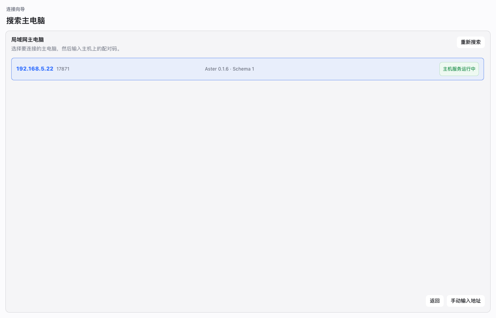

常见模式：

- 主电脑：保存主要业务数据，开启主机服务。
- 客户端电脑：连接主电脑，共用主电脑上的库存数据。

### 6.1 第一次在客户端电脑登录前连接主电脑

如果账号是在主电脑上创建的，新电脑第一次使用前需要先连接主电脑。

操作流程：

1. 打开客户端。
2. 在登录页点击“连接主电脑”。
3. 在连接向导中搜索主电脑。
4. 选择搜索到的主电脑。
5. 输入主电脑界面上显示的配对码。
6. 填写这台电脑名称。
7. 点击连接。
8. 连接成功后，再返回登录页使用主电脑上的账号登录。

### 6.2 搜索不到主电脑

请检查：

- 主电脑是否开机。
- 主电脑是否已经开启主机服务。
- 两台电脑是否在同一局域网。
- 防火墙是否阻止主机服务端口。
- 客户端是否可以访问主电脑 IP。

如果自动搜索不到，可以点击“手动输入地址”，填写主电脑 IP 和端口。

### 6.3 主电脑管理已连接设备

主电脑可以查看已连接的其他电脑。

如果某台设备不再使用，管理员可以将其移除。移除后，该设备需要重新配对才能继续连接。

## 7. 首页工作台

首页用于快速了解当前运营状态。

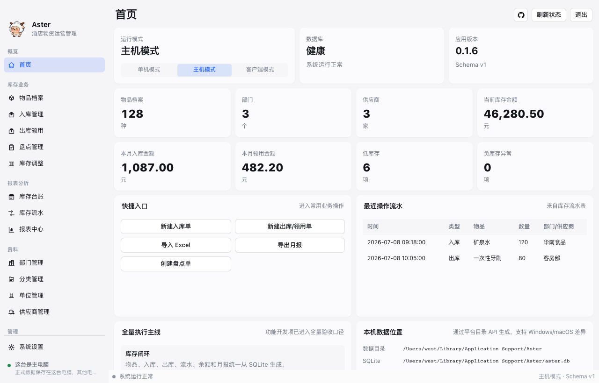

常见信息包括：

- 当前库存概况。
- 低库存预警。
- 最近入库、出库、盘点和调整记录。
- 当前运行模式。
- 数据目录、备份目录和导出目录。

建议每天打开系统后先查看首页，确认是否有库存异常或备份提醒。

## 8. 物品档案

物品档案用于维护酒店所有需要管理库存的物品，例如矿泉水、牙刷、拖鞋、清洁用品、工程耗材等。

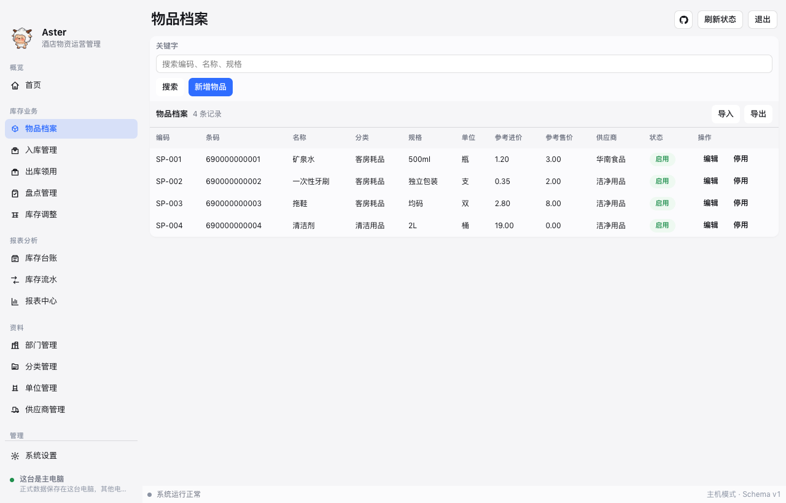

### 8.1 新增物品

进入“物品档案”，点击“新增物品”，填写：

- 物品名称：例如矿泉水、牙刷、拖鞋。
- 条码：可选，有扫码枪时可填写商品条码。
- 分类：用于筛选、报表和预算统计。
- 规格：例如 500ml、10 个/包、独立包装。
- 单位：例如瓶、件、包、盒。
- 参考进价：采购入库时默认带出的参考价格。
- 参考售价：酒店客人销售时默认带出的参考销售价格。
- 默认供应商：常用供应商，可选。
- 预警线：低于该数量时进入库存预警。
- 备注：补充说明。

### 8.2 参考进价和参考售价

参考进价和参考售价只是录入时的默认值，不代表每次业务的最终价格。

例如：

- 矿泉水参考进价 1.20 元，本次采购实际 1.35 元，入库时应填 1.35 元。
- 矿泉水参考售价 3.00 元，本次促销卖 2.00 元，客人销售时应填 2.00 元。

### 8.3 导入和导出物品档案

物品档案列表有导入、导出功能。

- 导入：选择 Excel，只导入物品档案，不生成入库和出库单据。
- 导出：按当前筛选条件导出物品档案 Excel。

客户端模式下，导出文件会保存到当前电脑自己的默认导出目录。

### 8.4 停用物品

不再使用的物品可以停用。

停用后：

- 不建议再用于新单据。
- 历史单据和历史报表仍然可以查看。

## 9. 分类、单位、部门、供应商

这些资料是业务单据和报表的基础。

### 9.1 分类

分类用于区分物品类型，例如：

- 客房耗材。
- 餐饮用品。
- 工程用品。
- 清洁用品。

分类会影响筛选、报表统计、预算规则和盘点范围。

### 9.2 单位

单位用于数量展示，例如瓶、件、包、盒、套。

新增物品前，应先维护好常用单位。

### 9.3 部门

部门用于内部员工领用和部门报表，例如客房、餐饮、工程、行政办。

内部员工领用必须选择部门。

### 9.4 供应商

供应商用于入库采购记录。

供应商页面可以查看供应商采购记录，方便核对历史采购。

## 10. 入库采购

入库用于记录采购到货，库存数量增加。

进入位置：入库菜单。

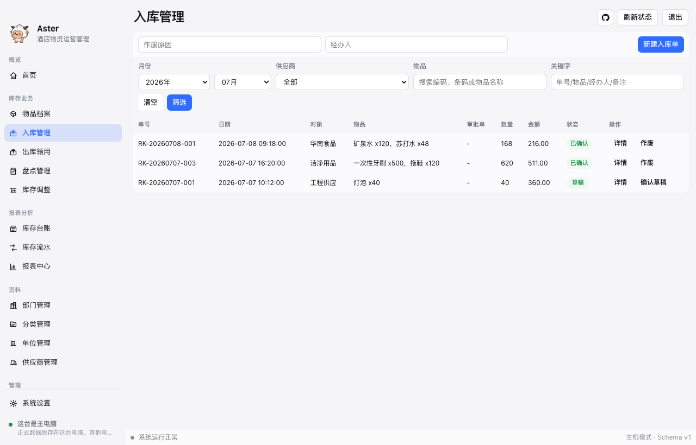

### 10.1 新建入库单

点击“新增入库”，填写：

- 业务日期：真实入库日期和时间，不能选择未来时间。
- 供应商：本次采购供应商。
- 经办人：实际处理人。
- 备注：采购说明。
- 商品明细：选择物品，填写数量、本次进价和采购金额。

选择商品时支持模糊搜索，下拉结果中选择正确物品。

### 10.2 入库价格和批次

同一个物品每次采购价格可能不同。

Aster 会按每次确认入库生成采购批次。每个批次会记录：

- 入库时间。
- 来源单据。
- 供应商。
- 本次采购单价。
- 原始数量。
- 剩余数量。
- 剩余金额。

因此，入库时必须填写本次真实采购价。

### 10.3 保存草稿和确认入库

保存草稿：

- 不影响库存。
- 可以后续继续修改。

确认入库：

- 库存数量增加。
- 形成库存流水。
- 生成采购批次。
- 后续出库会按批次计算成本。

### 10.4 入库列表和详情

入库列表可以按月份、供应商、物品和关键字筛选。

点击“详情”可以查看：

- 单据基本信息。
- 商品明细。
- 批次成本明细。

## 11. 出库/领用

出库用于记录库存减少。

出库分为两类：

- 内部员工领用。
- 酒店客人销售。

进入位置：出库菜单。

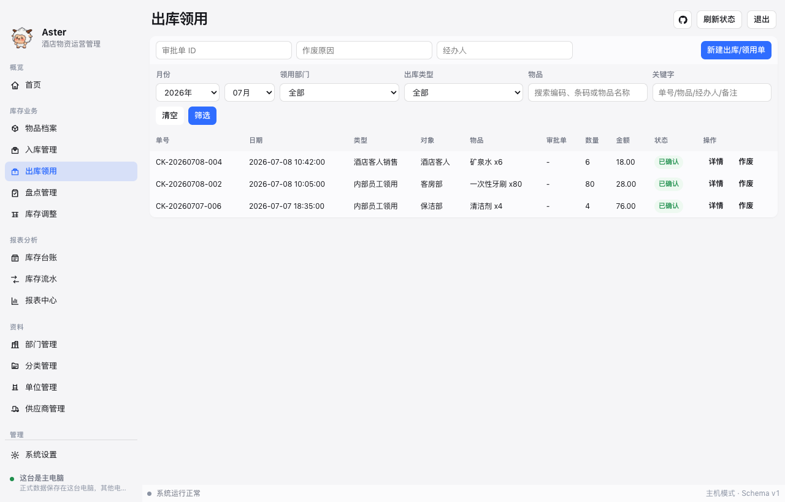

### 11.1 内部员工领用

适用于酒店内部消耗，例如：

- 客房领用牙刷、拖鞋、矿泉水。
- 工程领用工具耗材。
- 保洁领用清洁用品。

填写内容：

- 业务日期和时间，不能选择未来时间。
- 出库类型选择“内部员工领用”。
- 领用部门。
- 经办人。
- 用途或备注。
- 商品和数量。

内部领用不需要填写销售价格。

### 11.2 酒店客人销售

适用于对客销售商品，例如客人购买矿泉水、拖鞋、洗漱用品。

填写内容：

- 业务日期和时间，不能选择未来时间。
- 出库类型选择“酒店客人销售”。
- 经办人。
- 商品。
- 数量。
- 销售单价。
- 销售金额。
- 备注。

销售单价默认带出物品档案中的参考售价，可以按实际售价修改。

### 11.3 可用库存

出库选择商品时，列表会显示可用库存。

出库前请核对：

- 选择的物品是否正确。
- 可用库存是否足够。
- 数量是否录入正确。

### 11.4 出库成本如何计算

Aster 按先进先出 FIFO 计算出库成本。

例如商品 A：

- 第一次入库：5 个，单价 12 元。
- 第二次入库：10 个，单价 20 元。

出库时会先扣第一次入库的 5 个；第一次批次扣完后，再扣第二次入库的库存。

因此，同一张出库单可能对应多个入库批次成本。

### 11.5 客人销售低于成本

如果销售价格低于采购成本，系统允许提交。

可能原因包括：

- 促销。
- 赔偿。
- 特殊折扣。
- 售价录错。
- 采购成本异常偏高。

报表会体现销售收入、出库成本和毛利，管理人员可据此检查异常。

### 11.6 出库列表和详情

出库列表可以按月份、部门、物品和关键字筛选。

点击“详情”可以查看：

- 单据基本信息。
- 商品明细。
- 批次成本明细。
- 客人销售收入和成本。

## 12. 单据作废

如果入库或出库录错，可以按权限进行作废。

作废前请注意：

- 作废已确认单据会影响库存。
- 作废会生成反向库存流水。
- 如果入库批次已经被后续出库消耗，可能无法直接作废。
- 作废原因应填写清楚，便于后续追查。

不确定是否可以作废时，请先联系管理员。

## 13. 库存台账

库存台账用于查看当前库存结果。

它回答的是：现在每个物品还有多少、库存金额是多少。

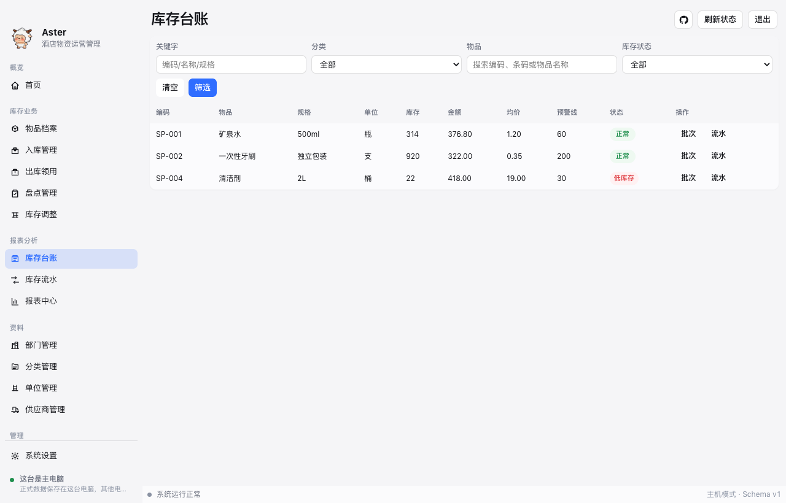

常见字段：

- 物品名称。
- 分类。
- 单位。
- 当前库存数量。
- 库存金额。
- 平均成本。
- 最近入库价。
- 预警线。
- 库存状态。

如果只是想知道库存够不够，看库存台账。

## 14. 库存流水

库存流水用于查看库存变化过程。

它回答的是：库存为什么变成现在这样。

每次入库、出库、盘点、调整、作废冲正都会产生库存流水。

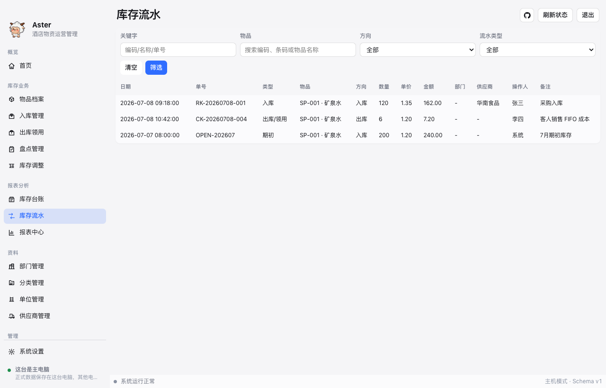

常见字段：

- 日期和时间。
- 单据号。
- 类型。
- 物品。
- 入库或出库方向。
- 数量。
- 单价。
- 金额。
- 部门或供应商。
- 操作人。
- 备注。

如果台账数量不对，需要追查原因，看库存流水。

## 15. 批次库存

批次库存用于查看同一个物品不同采购来源的剩余库存。

在库存台账中点击批次相关入口，可以查看某个物品的批次。

常见字段：

- 批次号。
- 入库日期和时间。
- 来源单据。
- 供应商。
- 原始数量。
- 剩余数量。
- 批次单价。
- 剩余金额。

批次库存适合用于核对成本和采购价格变化。

## 16. 库存调整

库存调整用于处理非正常库存变化，例如：

- 盘外增加。
- 损耗。
- 报损。
- 纠错。

填写内容：

- 调整日期和时间，不能选择未来时间。
- 调整类型。
- 经办人。
- 原因。
- 商品。
- 方向。
- 数量。
- 单价和金额。

库存调整会直接影响库存，请谨慎操作。

## 17. 库存盘点

盘点用于核对实际库存和系统库存是否一致。

进入位置：库存盘点菜单。

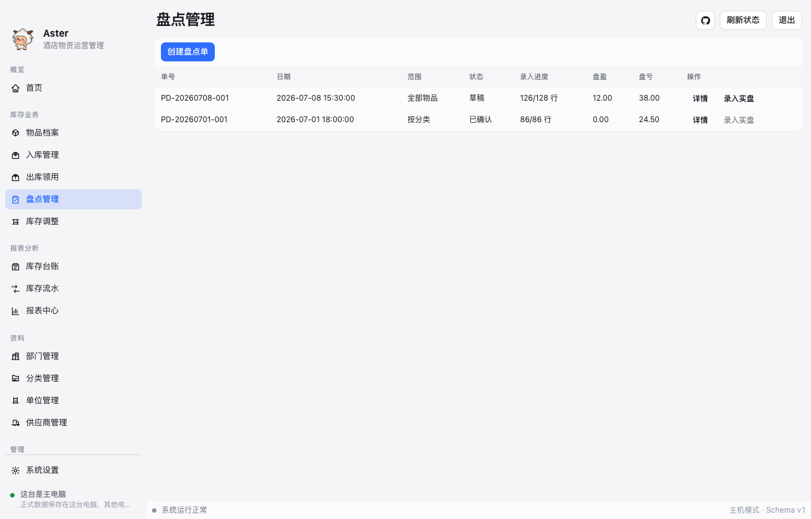

### 17.1 创建盘点单

点击“创建盘点单”，选择盘点范围：

- 盘点日期和时间，不能选择未来时间。
- 全部物品。
- 某个分类。
- 自定义物品。

创建后，系统会生成盘点明细。

### 17.2 录入实盘数量

点击“录入实盘”，填写实际盘点数量。

系统会自动计算：

- 账面数量。
- 实盘数量。
- 差异数量。
- 差异金额。

### 17.3 确认盘点

确认盘点后，系统会按差异调整库存。

确认前必须核对实盘数量。确认后会生成库存流水。

### 17.4 盘点导出

盘点表可以导出，用于线下盘点、签字或归档。

导出位置取决于系统设置中的默认导出目录。

## 18. 报表中心

报表中心用于查看月度经营和库存情况。

可以按月份、部门、分类、物品和供应商筛选。

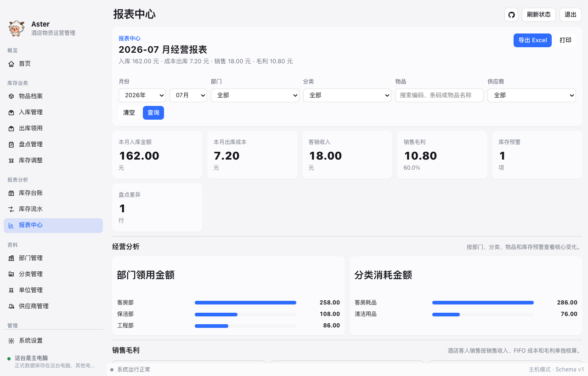

常见内容包括：

- 本月入库金额。
- 本月出库成本。
- 客销收入。
- 销售毛利。
- 库存预警。
- 部门领用金额。
- 分类消耗金额。
- 物品消耗排行。
- 盘点差异。

报表中心页面主要展示摘要和图表。完整明细建议导出 Excel 查看。

### 18.1 月份选择

报表月份使用月份选择控件。

查看某个月数据时，请先确认月份正确，再查看报表或导出。

### 18.2 客人销售毛利

客人销售毛利 = 销售收入 - FIFO 出库成本。

如果毛利为负，说明销售金额低于系统计算出的出库成本，需要管理人员核查原因。

## 19. Excel 导出

报表中心可导出 Excel。

导出文件通常包含：

- 月度进销存。
- 部门领用汇总。
- 部门领用明细。
- 分类消耗统计。
- 物品消耗排行。
- 入库明细。
- 出库明细。
- 销售毛利。
- 库存余额。
- 库存预警。
- 盘点差异。

如需对账、归档或发送给管理人员，建议使用导出功能。

## 20. Excel 导入

导入功能用于把整理好的 Excel 模板导入系统。

请使用软件生成的新版模板，不要再使用旧手工表格格式。

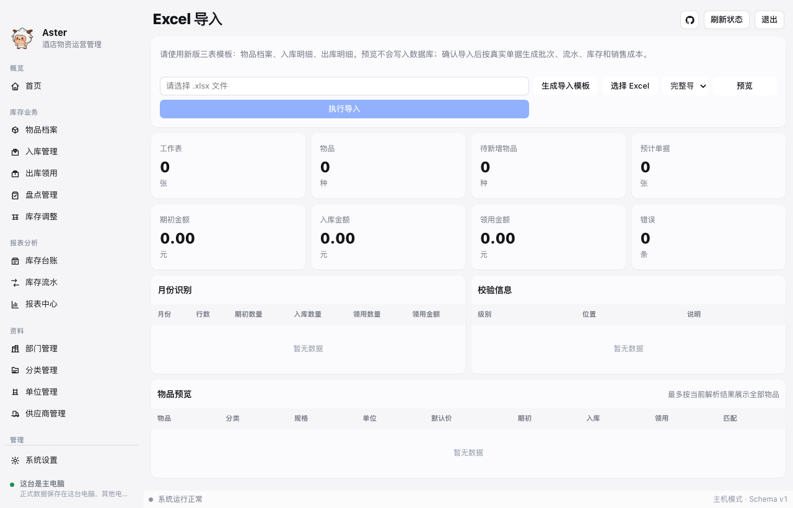

新版模板通常包含：

- 物品档案：物品编码、名称、分类、规格、单位、参考进价、参考售价和预警库存。
- 入库明细：业务时间、供应商、物品、数量、进货单价和进货金额。
- 出库明细：业务时间、出库类型、部门、物品、数量和销售单价。

业务时间必须包含真实时间，例如 `2026-07-01 09:00:00`。

一般流程：

1. 点击“生成导入模板”。
2. 打开模板，删除示例行后填写数据。
3. 回到软件选择 Excel 文件。
4. 点击预览。
5. 查看校验信息。
6. 确认无错误后执行导入。

导入后：

- 入库明细会生成真实入库单和采购批次。
- 出库明细会生成真实出库单和库存流水。
- 出库会按 FIFO 扣减入库批次。
- 酒店客人销售会记录销售收入、实际成本和毛利。

如果预览中有错误，需要先修改 Excel 或基础资料，再重新预览。

## 21. 预算控制

预算控制用于限制内部员工领用金额。

管理员可以按部门和月份设置预算，也可以按分类做更细的控制。

注意：

- 内部员工领用会占用预算。
- 酒店客人销售不占用预算。
- 超预算时，可能需要先走审批。
- 预算不一定必须限制到分类，按部门月份总额也可以使用。

## 22. 审批

审批用于处理超预算领用等需要管理员确认的事项。

一般流程：

1. 员工提交业务时触发预算限制。
2. 按提示发起审批。
3. 管理员进入审批页面查看申请。
4. 管理员通过或驳回。
5. 审批通过后，再回到对应业务单据继续提交。

审批记录用于后续核查，不建议随意删除或绕过。

## 23. 备份与恢复

Aster 数据保存在本地电脑或主电脑上，因此备份非常重要。

### 23.1 什么时候需要备份

建议以下情况前确认有备份：

- 大量 Excel 导入前。
- 恢复历史备份前。
- 清空测试数据前。
- 版本升级前。
- 做大量作废或调整前。

### 23.2 手动备份

管理员可以在备份页面创建手动备份。

备份文件可用于其他客户端恢复出相同数据，但恢复会覆盖当前数据。

### 23.3 自动备份

系统可按设置进行自动备份和间隔备份。

管理员应定期检查备份目录是否正常、磁盘空间是否足够。

### 23.4 恢复备份

恢复备份会覆盖当前数据。

恢复前请确认：

- 备份文件来源正确。
- 备份时间正确。
- 当前数据确实可以被覆盖。

不熟悉恢复操作时，请先联系管理员。

## 24. 系统设置

系统设置用于维护客户端和业务运行配置。

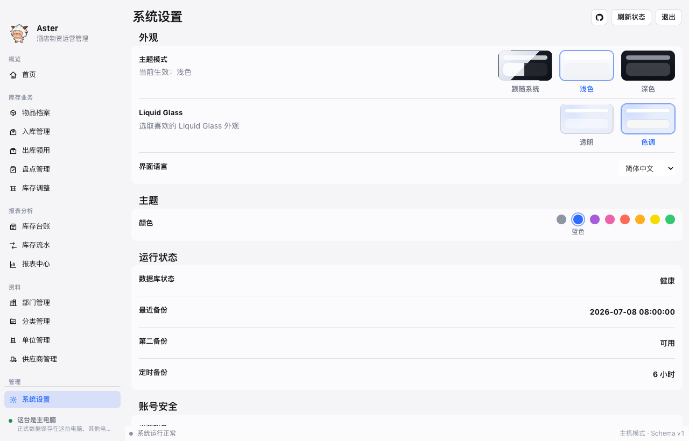

常见设置包括：

- 界面语言。
- 主题和外观。
- 默认导出目录。
- 默认备份目录。
- 业务参数。
- 邮箱验证码发件配置。
- 主机/客户端连接。

部分设置只有管理员可以修改。

客户端模式下，每台电脑可以维护自己的本地导出目录和备份目录，避免所有电脑都使用主电脑路径。

## 25. 用户与权限

管理员可以维护用户账号和权限。

常见角色：

- 管理员：可维护系统设置、用户、备份恢复、预算审批等。
- 仓库员：可维护物品、入库、出库、盘点和导入。
- 部门查看人员：查看本部门相关数据。
- 只读人员：只查看，不新增或修改。

如果员工离职或不再使用系统，应及时停用账号。

## 26. 操作日志

操作日志用于记录关键操作，便于追溯。

常见记录包括：

- 登录。
- 新增或修改资料。
- 入库、出库、盘点、调整。
- 作废。
- 备份和恢复。
- 系统设置变更。

管理员可在需要时查看操作日志。

## 27. 常见问题

### 27.1 台账和流水有什么区别

库存台账看当前结果。

库存流水看变化过程。

例如台账显示矿泉水还剩 30 瓶；如果想知道为什么只剩 30 瓶，就去看库存流水。

### 27.2 入库价格填错怎么办

如果单据还没确认，可以编辑草稿。

如果已经确认，需要按权限和实际情况作废后重新录入。

### 27.3 出库数量超过库存怎么办

系统通常会提示库存不足。

请先核对库存台账、批次库存和实际库存。

### 27.4 为什么客人销售毛利为负

说明销售金额低于系统计算出的出库成本。

可能原因包括促销、赔偿、售价录错或采购成本过高。

### 27.5 为什么看不到某个菜单

通常是当前账号没有权限。

请联系管理员确认角色和权限。

### 27.6 客户端为什么提示未完成主机配对

说明当前电脑还没有成功连接主电脑。

请在登录页或系统设置中打开连接向导，完成主机搜索、配对码输入和连接。

### 27.7 为什么导出文件找不到

请检查系统设置中的默认导出目录。

客户端模式下，每台电脑使用自己的本地导出目录。

### 27.8 为什么月份筛选没有数据

请确认：

- 选择的月份是否正确。
- 单据业务日期是否属于该月份。
- 是否设置了部门、分类、物品或供应商筛选条件。

### 27.9 日期能不能填过去或未来

业务日期允许填写过去的真实业务时间。

业务日期不允许填写未来时间。

### 27.10 本地数据如何在多台电脑一致

推荐使用主机/客户端模式。

主电脑保存主要数据库，其他电脑作为客户端连接主电脑。这样多台电脑看到的是同一套业务数据。

## 28. 日常检查清单

每天建议检查：

- 是否能正常登录。
- 首页是否有库存预警。
- 当日入库是否已录入。
- 当日出库是否已录入。
- 是否存在未确认草稿。

每周建议检查：

- 低库存物品。
- 库存台账和实际库存是否明显不符。
- 备份是否正常生成。

每月建议检查：

- 月度报表。
- 部门领用统计。
- 客人销售毛利。
- 盘点差异。
- 备份文件是否可用。

## 29. 交接注意事项

员工交接时，请确认：

- 是否已交接账号。
- 是否已说明本岗位常用菜单。
- 是否已说明入库和出库填写规则。
- 是否已说明不能随意作废、恢复备份和清空数据。
- 是否已说明遇到异常时联系管理员。
